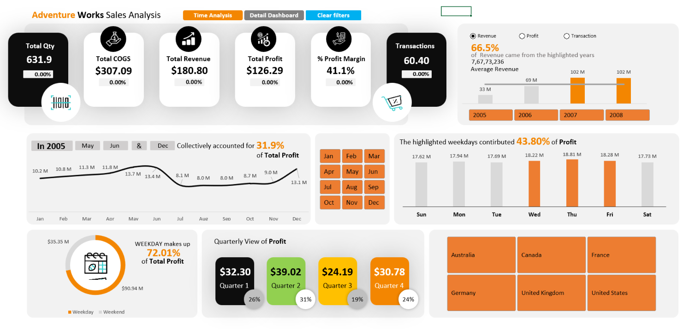
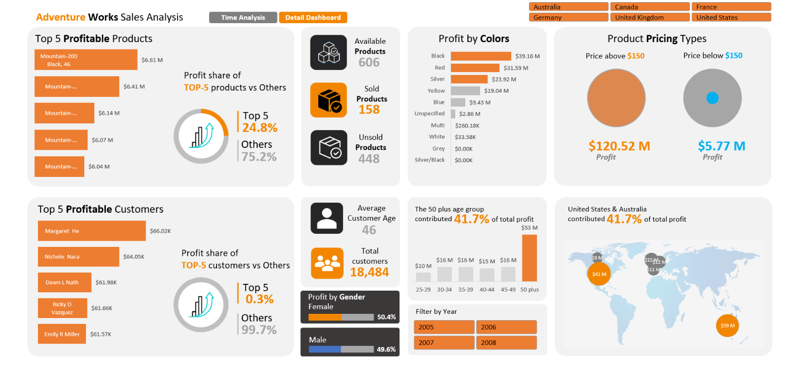

# 📊 Adventure Works Sales & Profitability Dashboard

## 📌 Project Overview

This project analyzes multi-table transactional sales data from Adventure Works to evaluate revenue, cost of goods sold (COGS), profitability, product performance, customer demographics, and regional sales performance.

The dashboard was developed using Microsoft Excel with Power Query, Power Pivot, Data Modeling, and DAX to transform raw data into an interactive business intelligence dashboard.

## 🛠️ Tools & Technologies

* Microsoft Excel
* Power Query
* Power Pivot
* DAX
* Data Modeling
* Excel Dashboarding

## 🔄 Project Workflow

```text
Raw Data
    ↓
Power Query
    ↓
Data Cleaning & Transformation
    ↓
Data Modeling
    ↓
DAX Measures
    ↓
Interactive Excel Dashboard
```

## 📂 Project Structure

```text
excel-sales-dashboard/
│
├── README.md
├── Sales_dashboard.xlsm
│
├── Data/
│   └── AdventureWorks.xlsx
│
├── Screenshots/
│   ├── Dashboard-overview.png
│   └── Product-customer-analysis.png
│
└── Documentation/
    └── data_dictionary.md
```

## 🔧 Key Tasks

### 1. Data Extraction & Transformation

* Imported multiple relational tables using Power Query.
* Worked with sales, product, customer, geography, territory, and date tables.
* Cleaned and transformed raw data for analysis.
* Handled missing and unspecified values.
* Created calculated fields for revenue, cost, and profit.
* Created a custom date table for time-based analysis.

### 2. Data Modeling

* Created relationships between fact and dimension tables.
* Built a star-schema style data model.
* Used Power Pivot to manage the data model.
* Created DAX measures for business KPIs and analytical calculations.

### 3. Business Analysis

Analyzed:

* Revenue performance
* Cost and profitability
* Product performance
* Customer demographics
* Regional sales
* Product price segments
* Year-over-year performance

## 📊 KPI Analysis

The dashboard includes key business metrics such as:

* **Total Revenue**
* **Total Cost**
* **Total Profit**
* **Profit Margin %**
* **Number of Transactions**
* **Total Products**
* **Sold Products**
* **Unsold Products**

## 📈 Dashboard

The interactive Excel dashboard provides analysis across multiple business dimensions, including:

* Year-over-year sales performance
* Product profitability
* Customer demographics
* Regional performance
* Product price segments
* Revenue and profit trends

### Dashboard Overview



### Product & Customer Analysis



## 💡 Key Insights

* The top 5 profitable products contribute approximately 45% of total revenue in key regions such as Canada.
* Out of 606 catalog products, 158 products generated sales during the analyzed period.
* 448 products did not generate sales during the analyzed period.
* The analysis highlights differences in product profitability, customer demographics, and regional performance.

## 📚 Skills Demonstrated

* Data Cleaning
* Data Transformation
* Data Modeling
* Power Query
* Power Pivot
* DAX
* Excel Dashboard Development
* KPI Analysis
* Business Analysis
* Data Visualization

## 📁 Project Files

- [📊 Sales Dashboard](Sales-dashboard.xlsm)
- [🗄️ Raw Dataset](Data/AdventureWorks.xlsx)
- [📖 Data Dictionary](Documentation/data_dictionary.md)
